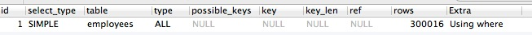
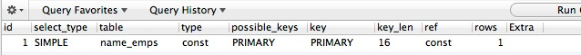

.. _huizong:

不要从明细表查统计结果，定期统计插入到汇总表
=====================================================

一般做法
--------------

.. code-block:: mysql

    EXPLAIN 
    SELECT 
      `first_name`,
      COUNT(1) AS emps 
    FROM
      `employees` 
    WHERE `first_name` = 'Georgi' 
    GROUP BY `first_name` 

使用汇总表
--------------

建立汇总表：

.. code-block:: mysql

    CREATE TABLE `name_emps` (
        `first_name` VARCHAR(14) PRIMARY KEY,
        `count_num` INT
        );

定时插入数据进汇总表之前先清空汇总表：

.. code-block:: mysql

    TRUNCATE TABLE name_emps;

定时插入数据进汇总表：

.. code-block:: mysql

    INSERT INTO `name_emps` (`first_name`, `count_num`) 
    SELECT 
      `first_name`,
      COUNT(1) AS emps 
    FROM
      `employees` 
    GROUP BY `first_name` 
    
查询汇总表数据：

.. code-block:: mysql

    EXPLAIN
    SELECT 
      `first_name`,
      `count_num` 
    FROM
      `employees`.`name_emps` 
    WHERE `first_name` = 'Georgi' 

