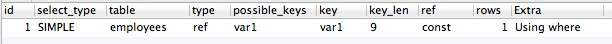

.. _var1:

字符型，数值型字段类型不能混合使用，依赖后期转换 
===============================================================================

*试验*：
表employees增加字符列，存储数字,并建立索引。

.. code-block:: mysql

    ALTER TABLE employees 
      ADD COLUMN var1 VARCHAR (6);
    CREATE INDEX var1 
    ON employees (var1);

把emp_no更新到var1列。

.. code-block:: mysql

    UPDATE 
      employees 
    SET
      var1 = emp_no 

用explain 查询，注意2幅截图的"key"字段。

.. code-block:: mysql

    EXPLAIN
    SELECT
      `emp_no`,
      `birth_date`,
      `first_name`,
      `last_name`,
      `gender`,
      `hire_date`
    FROM `employees`.`employees`
    WHERE var1=10001;

    
    

.. code-block:: mysql

    EXPLAIN
    SELECT
      `emp_no`,
      `birth_date`,
      `first_name`,
      `last_name`,
      `gender`,
      `hire_date`
    FROM `employees`.`employees`
    WHERE var1='10001';

