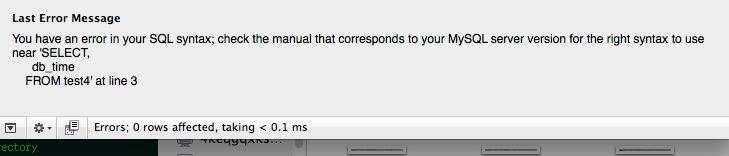

字段名称不能使用关键字
==============================================

如count, group, int, select 等,避免使用关键字，减少出错机率.

.. code-block:: mysql

    CREATE TABLE test1 (
      `id` INT PRIMARY KEY,
      `select` INT,
      `db_time` TIMESTAMP
    )

查询时列名加“`" 会得到正确结果：

.. code-block:: mysql

    SELECT
      `id`,
      `select`,
      `db_time`
    FROM `test1`

如果忘了加”`"号，则下面语句会出错

.. code-block:: mysql

    SELECT
      id,
      SELECT,
      db_time
    FROM test1
    
