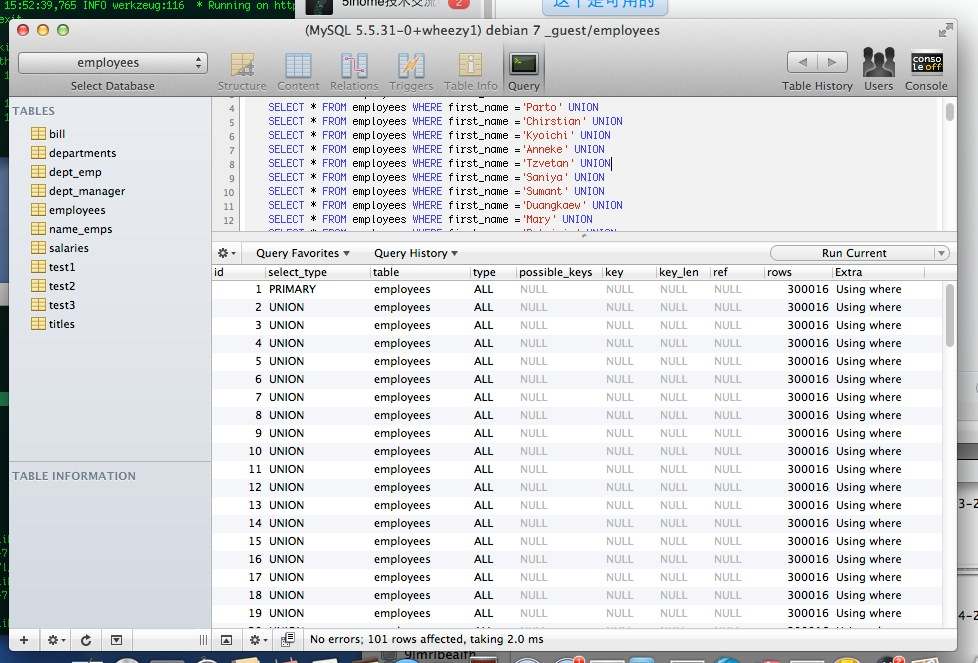
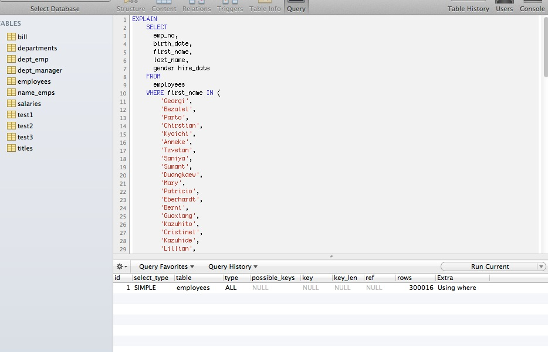

一般情况下，一次查询只会用到一个索引 (特定情况出现merge index的情况,如下可能出现(a=1 or b=2)会合并a和b的索引,或者使用union all)
===========================================================================================================================================================================================================================================================================

explain mysql测试合并索引

建立索引:

.. code-block:: mysql

    CREATE INDEX emplyees_firstname 
    ON employees (first_name);

    CREATE INDEX emplyees_lastname 
    ON employees (last_name);

a=1 or b=2 情况下：

.. code-block:: mysql

    EXPLAIN 
    SELECT 
      emp_no,
      birth_date,
      first_name,
      last_name,
      gender hire_date 
    FROM
      employees 
    WHERE first_name = 'Georgi' 
      OR last_name = 'Simmel' ;
      
+---+-------------+-----------+-------------+-----------------------------+------------------------------+--------+----+-----+---------+--------------------------------------------------------+
|id | select_type | table     | type        | possible_keys               |  key                         |key_len | ref|rows | filtered|  Extra                                                 |
+===+=============+===========+=============+=============================+==============================+========+====+=====+=========+========================================================+
|1  | SIMPLE      | employees | index_merge | emplyees_firstname,last_name|  emplyees_firstname,last_name| 16,18  |    | 420 |  100.00 |  Using union(emplyees_firstname,last_name); Using where|  
+---+-------------+-----------+-------------+-----------------------------+------------------------------+--------+----+-----+---------+--------------------------------------------------------+

.. code-block:: mysql

    EXPLAIN EXTENDED
    SELECT 
      emp_no,
      birth_date,
      first_name,
      last_name,
      gender hire_date 
    FROM
      employees 
    WHERE first_name =  'Georgi'
    UNION
    ALL 
    SELECT 
      emp_no,
      birth_date,
      first_name,
      last_name,
      gender hire_date 
    FROM
      employees 
    WHERE last_name = 'Simmel' ;

+---+-------------+-----------+-----+--------------------+-------------------+----------+------+----+--------+---------------+
|id | select_type |table      |type | possible_keys      | key               |  key_len | ref  |rows|filtered| Extra         |
+===+=============+===========+=====+====================+===================+==========+======+====+========+===============+
|1  | PRIMARY     |employees  |ref  | emplyees_firstname | emplyees_firstname|  16      | const| 253| 100.00 |  Using where  |
+---+-------------+-----------+-----+--------------------+-------------------+----------+------+----+--------+---------------+
|2  | UNION       |employees  |ref  | last_name          | last_name         |  18      | const| 167| 100.00 |  Using where  |
+---+-------------+-----------+-----+--------------------+-------------------+----------+------+----+--------+---------------+

*    in与union:当条件参数为大量的时候，union all 明显慢于in

30W数据:

*    无索引情况下：执行100条语句union耗时0.795秒，用in条件0.001秒
*    有索引情况下： 执行100条语句union耗时0.005秒，用in条件0.002秒

90W数据

*    有索引情况下： 执行100条语句union耗时0.028秒，用in条件0.000秒

.. codeblock:: mysql

    EXPLAIN SELECT * FROM employees WHERE first_name ='Georgi' UNION
    SELECT * FROM employees WHERE first_name ='Bezalel' UNION
    SELECT * FROM employees WHERE first_name ='Parto' UNION
    SELECT * FROM employees WHERE first_name ='Chirstian' UNION
    SELECT * FROM employees WHERE first_name ='Kyoichi' UNION
    SELECT * FROM employees WHERE first_name ='Anneke' UNION
    SELECT * FROM employees WHERE first_name ='Tzvetan' UNION
    SELECT * FROM employees WHERE first_name ='Saniya' UNION
    SELECT * FROM employees WHERE first_name ='Sumant' UNION
    SELECT * FROM employees WHERE first_name ='Duangkaew' UNION
    SELECT * FROM employees WHERE first_name ='Mary' UNION
    SELECT * FROM employees WHERE first_name ='Patricio' UNION
    SELECT * FROM employees WHERE first_name ='Eberhardt' UNION
    SELECT * FROM employees WHERE first_name ='Berni' UNION
    SELECT * FROM employees WHERE first_name ='Guoxiang' UNION
    SELECT * FROM employees WHERE first_name ='Kazuhito' UNION
    SELECT * FROM employees WHERE first_name ='Cristinel' UNION
    SELECT * FROM employees WHERE first_name ='Kazuhide' UNION
    SELECT * FROM employees WHERE first_name ='Lillian' UNION
    SELECT * FROM employees WHERE first_name ='Mayuko' UNION
    SELECT * FROM employees WHERE first_name ='Ramzi' UNION
    SELECT * FROM employees WHERE first_name ='Shahaf' UNION
    SELECT * FROM employees WHERE first_name ='Bojan' UNION
    SELECT * FROM employees WHERE first_name ='Suzette' UNION
    SELECT * FROM employees WHERE first_name ='Prasadram' UNION
    SELECT * FROM employees WHERE first_name ='Yongqiao' UNION
    SELECT * FROM employees WHERE first_name ='Divier' UNION
    SELECT * FROM employees WHERE first_name ='Domenick' UNION
    SELECT * FROM employees WHERE first_name ='Otmar' UNION
    SELECT * FROM employees WHERE first_name ='Elvis' UNION
    SELECT * FROM employees WHERE first_name ='Karsten' UNION
    SELECT * FROM employees WHERE first_name ='Jeong' UNION
    SELECT * FROM employees WHERE first_name ='Arif' UNION
    SELECT * FROM employees WHERE first_name ='Bader' UNION
    SELECT * FROM employees WHERE first_name ='Alain' UNION
    SELECT * FROM employees WHERE first_name ='Adamantios' UNION
    SELECT * FROM employees WHERE first_name ='Pradeep' UNION
    SELECT * FROM employees WHERE first_name ='Huan' UNION
    SELECT * FROM employees WHERE first_name ='Alejandro' UNION
    SELECT * FROM employees WHERE first_name ='Weiyi' UNION
    SELECT * FROM employees WHERE first_name ='Uri' UNION
    SELECT * FROM employees WHERE first_name ='Magy' UNION
    SELECT * FROM employees WHERE first_name ='Yishay' UNION
    SELECT * FROM employees WHERE first_name ='Mingsen' UNION
    SELECT * FROM employees WHERE first_name ='Moss' UNION
    SELECT * FROM employees WHERE first_name ='Lucien' UNION
    SELECT * FROM employees WHERE first_name ='Zvonko' UNION
    SELECT * FROM employees WHERE first_name ='Florian' UNION
    SELECT * FROM employees WHERE first_name ='Basil' UNION
    SELECT * FROM employees WHERE first_name ='Yinghua' UNION
    SELECT * FROM employees WHERE first_name ='Hidefumi' UNION
    SELECT * FROM employees WHERE first_name ='Heping' UNION
    SELECT * FROM employees WHERE first_name ='Sanjiv' UNION
    SELECT * FROM employees WHERE first_name ='Mayumi' UNION
    SELECT * FROM employees WHERE first_name ='Georgy' UNION
    SELECT * FROM employees WHERE first_name ='Brendon' UNION
    SELECT * FROM employees WHERE first_name ='Ebbe' UNION
    SELECT * FROM employees WHERE first_name ='Berhard' UNION
    SELECT * FROM employees WHERE first_name ='Breannda' UNION
    SELECT * FROM employees WHERE first_name ='Tse' UNION
    SELECT * FROM employees WHERE first_name ='Anoosh' UNION
    SELECT * FROM employees WHERE first_name ='Gino' UNION
    SELECT * FROM employees WHERE first_name ='Udi' UNION
    SELECT * FROM employees WHERE first_name ='Satosi' UNION
    SELECT * FROM employees WHERE first_name ='Kwee' UNION
    SELECT * FROM employees WHERE first_name ='Claudi' UNION
    SELECT * FROM employees WHERE first_name ='Charlene' UNION
    SELECT * FROM employees WHERE first_name ='Margareta' UNION
    SELECT * FROM employees WHERE first_name ='Reuven' UNION
    SELECT * FROM employees WHERE first_name ='Hisao' UNION
    SELECT * FROM employees WHERE first_name ='Hironoby' UNION
    SELECT * FROM employees WHERE first_name ='Shir' UNION
    SELECT * FROM employees WHERE first_name ='Mokhtar' UNION
    SELECT * FROM employees WHERE first_name ='Gao' UNION
    SELECT * FROM employees WHERE first_name ='Erez' UNION
    SELECT * FROM employees WHERE first_name ='Mona' UNION
    SELECT * FROM employees WHERE first_name ='Danel' UNION
    SELECT * FROM employees WHERE first_name ='Kshitij' UNION
    SELECT * FROM employees WHERE first_name ='Premal' UNION
    SELECT * FROM employees WHERE first_name ='Zhongwei' UNION
    SELECT * FROM employees WHERE first_name ='Parviz' UNION
    SELECT * FROM employees WHERE first_name ='Vishv' UNION
    SELECT * FROM employees WHERE first_name ='Tuval' UNION
    SELECT * FROM employees WHERE first_name ='Kenroku' UNION
    SELECT * FROM employees WHERE first_name ='Somnath' UNION
    SELECT * FROM employees WHERE first_name ='Xinglin' UNION
    SELECT * FROM employees WHERE first_name ='Jungsoon' UNION
    SELECT * FROM employees WHERE first_name ='Sudharsan' UNION
    SELECT * FROM employees WHERE first_name ='Kendra' UNION
    SELECT * FROM employees WHERE first_name ='Amabile' UNION
    SELECT * FROM employees WHERE first_name ='Valdiodio' UNION
    SELECT * FROM employees WHERE first_name ='Sailaja' UNION
    SELECT * FROM employees WHERE first_name ='Arumugam' UNION
    SELECT * FROM employees WHERE first_name ='Hilari' UNION
    SELECT * FROM employees WHERE first_name ='Jayson' UNION
    SELECT * FROM employees WHERE first_name ='Remzi' UNION
    SELECT * FROM employees WHERE first_name ='Sreekrishna' UNION
    SELECT * FROM employees WHERE first_name ='Valter' UNION
    SELECT * FROM employees WHERE first_name ='Hironobu' UNION
    SELECT * FROM employees WHERE first_name ='Perla'

无索引时扫描表１００次

.. code-block:: mysql

    SELECT 
      emp_no,
      birth_date,
      first_name,
      last_name,
      gender hire_date 
    FROM
      employees 
    WHERE first_name IN (
        'Georgi',
        'Bezalel',
        'Parto',
        'Chirstian',
        'Kyoichi',
        'Anneke',
        'Tzvetan',
        'Saniya',
        'Sumant',
        'Duangkaew',
        'Mary',
        'Patricio',
        'Eberhardt',
        'Berni',
        'Guoxiang',
        'Kazuhito',
        'Cristinel',
        'Kazuhide',
        'Lillian',
        'Mayuko',
        'Ramzi',
        'Shahaf',
        'Bojan',
        'Suzette',
        'Prasadram',
        'Yongqiao',
        'Divier',
        'Domenick',
        'Otmar',
        'Elvis',
        'Karsten',
        'Jeong',
        'Arif',
        'Bader',
        'Alain',
        'Adamantios',
        'Pradeep',
        'Huan',
        'Alejandro',
        'Weiyi',
        'Uri',
        'Magy',
        'Yishay',
        'Mingsen',
        'Moss',
        'Lucien',
        'Zvonko',
        'Florian',
        'Basil',
        'Yinghua',
        'Hidefumi',
        'Heping',
        'Sanjiv',
        'Mayumi',
        'Georgy',
        'Brendon',
        'Ebbe',
        'Berhard',
        'Breannda',
        'Tse',
        'Anoosh',
        'Gino',
        'Udi',
        'Satosi',
        'Kwee',
        'Claudi',
        'Charlene',
        'Margareta',
        'Reuven',
        'Hisao',
        'Hironoby',
        'Shir',
        'Mokhtar',
        'Gao',
        'Erez',
        'Mona',
        'Danel',
        'Kshitij',
        'Premal',
        'Zhongwei',
        'Parviz',
        'Vishv',
        'Tuval',
        'Kenroku',
        'Somnath',
        'Xinglin',
        'Jungsoon',
        'Sudharsan',
        'Kendra',
        'Amabile',
        'Valdiodio',
        'Sailaja',
        'Arumugam',
        'Hilari',
        'Jayson',
        'Remzi',
        'Sreekrishna',
        'Valter',
        'Hironobu',
        'Perla'
      )

