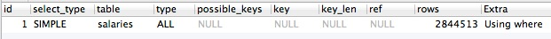
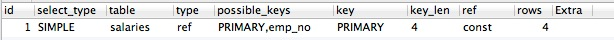
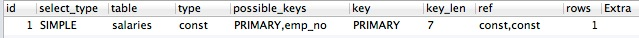

组合索引可以只使用第一个，或者前两个，或者前几个
==============================================================

组合索引可以只使用第一个，或者前两个，或者前几个，不能从第二个开始用，也不能跳着使用  

索引使用从前缀开始，多字段索引到between或者<,>等以后字段不会使用,排序最好在索引中实现

.. code-block:: mysql

    EXPLAIN SELECT
      `emp_no`,
      `salary`,
      `from_date`,
      `to_date`
    FROM `employees`.`salaries`
    WHERE from_date ='2000-07-15'

用到索引,注意下面2幅截图并不一样：

.. code-block:: mysql

    EXPLAIN SELECT
      `emp_no`,
      `salary`,
      `from_date`,
      `to_date`
    FROM `employees`.`salaries`
    WHERE emp_no = 100001 

或者：

.. code-block:: mysql

    EXPLAIN SELECT
      `emp_no`,
      `salary`,
      `from_date`,
      `to_date`
    FROM `employees`.`salaries`
    WHERE emp_no = 100001 AND from_date ='2000-07-15'
  

