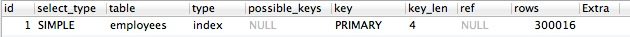
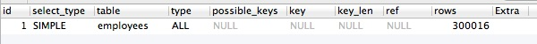

SQL语句中不要加用不到的排序
==========================================

排序使用主键索引，比不排序多了读取索引的步骤

.. code-block:: mysql

    EXPLAIN SELECT
      `emp_no`,
      `birth_date`,
      `first_name`,
      `last_name`,
      `gender`,
      `hire_date`,
      `var1`
    FROM `employees`.`employees`
    ORDER BY emp_no DESC

不使用索引：

.. code-block:: mysql

    EXPLAIN SELECT
      `emp_no`,
      `birth_date`,
      `first_name`,
      `last_name`,
      `gender`,
      `hire_date`,
      `var1`
    FROM `employees`.`employees`

      

